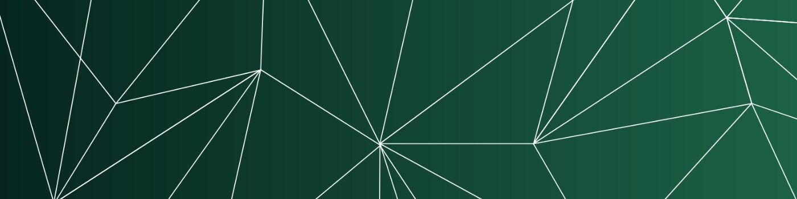

<h1>Hey, I'm Jordan! </h1>

<h2>🛡️ TryHackMe & HackTheBox Badges</h2>

<h2>🧑‍💻 Software Development Projects</h2>

- <b>🐍 Python</b>
  - [motivationalDiscordBot](https://github.com/jcobu/motivationalDiscordBot) <b><i>(a Discord bot that sends a "motivational" message)</b></i>

<h2>👋 Connect with me</h2>

[][linkedin]

[linkedin]: https://www.linkedin.com/in/jcobu

[][credly]

[credly]: https://www.credly.com/users/jcobu
